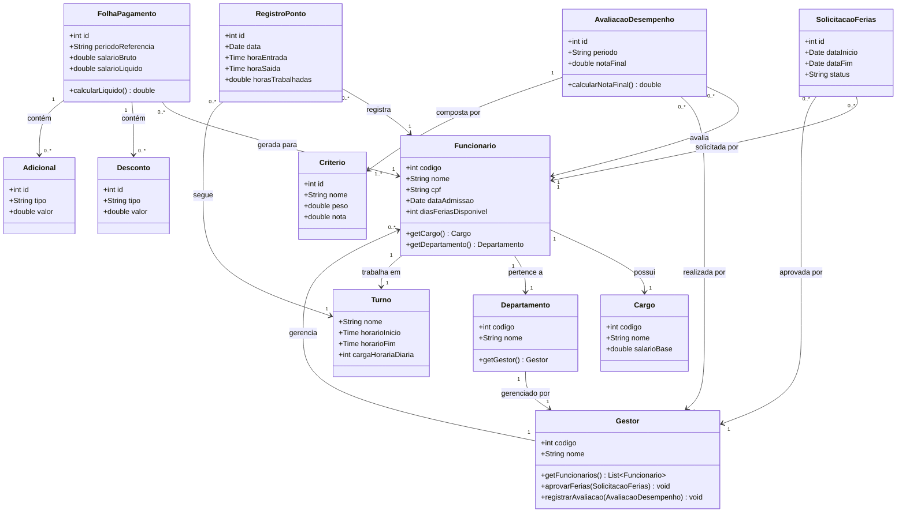

# Diagrama de Classes — RHSoft

```mermaid
classDiagram
    direction TB

    class Funcionario {
        +int codigo
        +String nome
        +String cpf
        +Date dataAdmissao
        +int diasFeriasDisponivel
        +getCargo() Cargo
        +getDepartamento() Departamento
    }

    class Cargo {
        +int codigo
        +String nome
        +double salarioBase
    }

    class Departamento {
        +int codigo
        +String nome
        +getGestor() Gestor
    }

    class Gestor {
        +int codigo
        +String nome
        +getFuncionarios() List~Funcionario~
        +aprovarFerias(SolicitacaoFerias) void
        +registrarAvaliacao(AvaliacaoDesempenho) void
    }

    class Turno {
        +String nome
        +Time horarioInicio
        +Time horarioFim
        +int cargaHorariaDiaria
    }

    class RegistroPonto {
        +int id
        +Date data
        +Time horaEntrada
        +Time horaSaida
        +double horasTrabalhadas
    }

    class SolicitacaoFerias {
        +int id
        +Date dataInicio
        +Date dataFim
        +String status
    }

    class FolhaPagamento {
        +int id
        +String periodoReferencia
        +double salarioBruto
        +double salarioLiquido
        +calcularLiquido() double
    }

    class Desconto {
        +int id
        +String tipo
        +double valor
    }

    class Adicional {
        +int id
        +String tipo
        +double valor
    }

    class AvaliacaoDesempenho {
        +int id
        +String periodo
        +double notaFinal
        +calcularNotaFinal() double
    }

    class Criterio {
        +int id
        +String nome
        +double peso
        +double nota
    }

    Funcionario "1" --> "1" Cargo : possui
    Funcionario "1" --> "1" Departamento : pertence a
    Funcionario "1" --> "1" Turno : trabalha em
    Departamento "1" --> "1" Gestor : gerenciado por
    Gestor "1" --> "0..*" Funcionario : gerencia

    RegistroPonto "0..*" --> "1" Funcionario : registra
    RegistroPonto "0..*" --> "1" Turno : segue

    SolicitacaoFerias "0..*" --> "1" Funcionario : solicitada por
    SolicitacaoFerias "0..*" --> "1" Gestor : aprovada por

    FolhaPagamento "0..*" --> "1" Funcionario : gerada para
    FolhaPagamento "1" --> "0..*" Desconto : contém
    FolhaPagamento "1" --> "0..*" Adicional : contém

    AvaliacaoDesempenho "0..*" --> "1" Funcionario : avalia
    AvaliacaoDesempenho "0..*" --> "1" Gestor : realizada por
    AvaliacaoDesempenho "1" --> "1..*" Criterio : composta por
```
