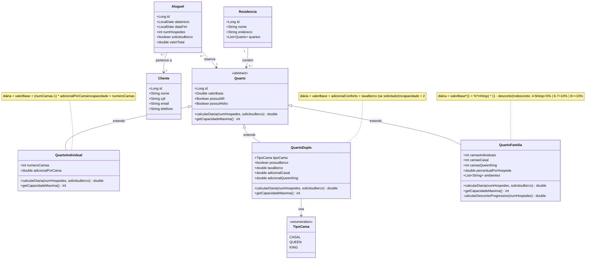

# Diagrama de Classes — Sistema de Hospedagem (Sprint 2)

```mermaid
classDiagram
    direction TB

    class Quarto {
        <<abstract>>
        +Long id
        +Double valorBase
        +Boolean possuiAR
        +Boolean possuiHidro
        +calcularDiaria(numHospedes, solicitouBerco) double
        +getCapacidadeMaxima() int
    }

    class QuartoIndividual {
        +int numeroCamas
        +double adicionalPorCama
        +calcularDiaria(numHospedes, solicitouBerco) double
        +getCapacidadeMaxima() int
    }
    note for QuartoIndividual "diária = valorBase + (numCamas-1) * adicionalPorCama\ncapacidade = numeroCamas"

    class QuartoDuplo {
        +TipoCama tipoCama
        +boolean possuiBerco
        +double taxaBerco
        +double adicionalCasal
        +double adicionalQueenKing
        +calcularDiaria(numHospedes, solicitouBerco) double
        +getCapacidadeMaxima() int
    }
    note for QuartoDuplo "diária = valorBase + adicionalConforto + taxaBerco (se solicitado)\ncapacidade = 2"

    class QuartoFamilia {
        +int camasIndividuais
        +int camasCasal
        +int camasQueenKing
        +double percentualPorHospede
        +List~String~ ambientes
        +calcularDiaria(numHospedes, solicitouBerco) double
        +getCapacidadeMaxima() int
        -calcularDescontoProgressivo(numHospedes) double
    }
    note for QuartoFamilia "diária = valorBase*(1 + %*nHósp) * (1 - desconto)\ndesconto: 4-5hósp=5% | 6-7=10% | 8+=15%"

    class TipoCama {
        <<enumeration>>
        CASAL
        QUEEN
        KING
    }

    class Residencia {
        +Long id
        +String nome
        +String endereco
        +List~Quarto~ quartos
    }

    class Cliente {
        +Long id
        +String nome
        +String cpf
        +String email
        +String telefone
    }

    class Aluguel {
        +Long id
        +LocalDate dataInicio
        +LocalDate dataFim
        +int numHospedes
        +boolean solicitouBerco
        +double valorTotal
    }

    Quarto <|-- QuartoIndividual : extends
    Quarto <|-- QuartoDuplo     : extends
    Quarto <|-- QuartoFamilia   : extends

    QuartoDuplo --> TipoCama : usa

    Residencia "1" --> "0..*" Quarto    : contém
    Aluguel    "0..*" --> "1" Cliente   : pertence a
    Aluguel    "0..*" --> "1" Quarto    : reserva
```
