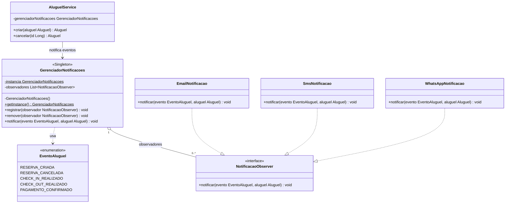
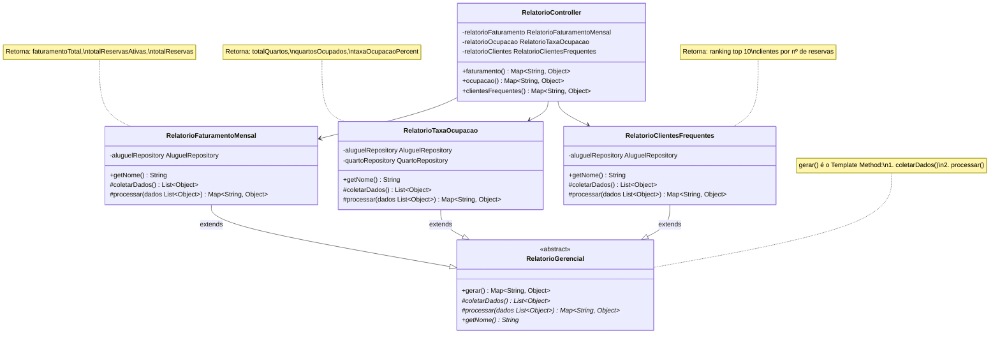

# Diagrama de Classes — Sistema de Hospedagem (Sprint 4)

## Padrão Observer — Central de Notificações

> **Singleton:** `GerenciadorNotificacoes` possui construtor privado e acesso via `getInstance()`. Uma única instância garante que todos os canais registrados recebam todos os eventos.
>
> **Observer:** `AluguelService` (publicador) dispara eventos para `GerenciadorNotificacoes`, que os repassa a cada `NotificacaoObserver` registrado (E-mail, SMS, WhatsApp). Novos canais são adicionados sem alterar nenhuma classe existente.

---

## Padrão Template Method — Relatórios Gerenciais

> **Template Method:** `gerar()` define o esqueleto do algoritmo como método `final`. As subclasses implementam apenas `coletarDados()` e `processar()`, sem alterar o fluxo geral. Adicionar um novo relatório requer apenas criar uma nova subclasse de `RelatorioGerencial`.
